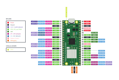
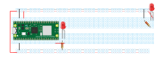
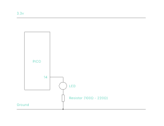
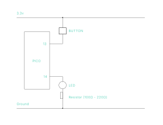
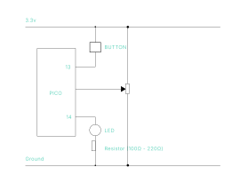
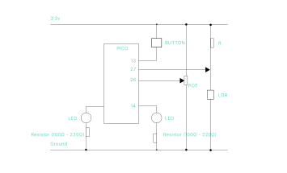
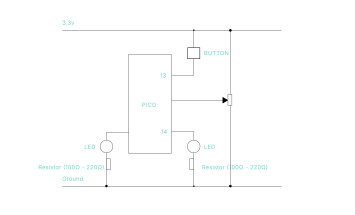

# Microcontroller Intro

## Overview

We will connect our microcontroller to any inputs, such as buttons and sensors, and outputs, such a lights, motors, and speakers. We will program our microcontroller to use the devices.

We program our microcontroller by editing a text file on the microcontroller. This requires a data-capable, USB cable to connect our computer to the microcontroller and an application to edit the text file and upload it. The first step is to follow the directions for your microcontroller. I have included the appropriate tutorials below.

This guide contains everything you need to set up your microcontroller: [Getting Started with Raspberry Pi Pico and CircuitPython](https://learn.adafruit.com/getting-started-with-raspberry-pi-pico-circuitpython)

1. Download the UF2 file [from this page](https://circuitpython.org/board/raspberry_pi_pico2_w/).
2. Follow the directions [on this page](https://learn.adafruit.com/getting-started-with-raspberry-pi-pico-circuitpython/circuitpython) to load the file on your chip.

Following those steps will cause the Raspberry PI Pico to appear as thumbdrive on your desktop. If you have or create a text file named _code.py_, it will run automatically. You can use Visual Studio Code with the circuitPython extension (in the VScode marketplace to edit your _code.py_ file.

Follow the VScode setup guide to let your computer and micro talk to each other. The basic steps are:

1. With micro connected via usb and the _CIRCUITPY_ drive on your desktop, open the command menu (Command+Shift+P) and select your board and Serial Port.
2. Still in the command menu, select Open Serial Port Monitor. This will open a new terminal.
3. In VScode click _File/Open Folder_, and select the _CIRCUITPY_ drive. This should open your drive and allow you to edit your **CODE.PY** file.
4. Open code.py and make it contain only <code>print("Hello world!")</code>.
5. Saving the file will run the file and send text to the _Serial Port Monitor_. Read the output carefully. If you see your hello world, all is well.

### Other microcontrollers

- [Adafruit Circuit Playground Express](https://learn.adafruit.com/adafruit-circuit-playground-express)

- [Arduino UNO](https://docs.arduino.cc/hardware/uno-rev3)

## Raspberry Pi Pico Pinout Diagram



## Connecting to a circuit

The next step is to connect your micro to circuit.

### Circuit illustration



### Circuit schematic



### Code

First we will blink an LED on pin GP14.

```python
led1 = digitalio.DigitalInOut(board.GP14)    # Make a variable for pin GP14.
led1.direction = digitalio.Direction.OUTPUT  # Make the pin an output pin.

while True:           # loop
    led1.value = 1    # turn on
    time.sleep(0.15)  # wait
    led1.value = 0    # turn off
    time.sleep(0.35)  # wait
```

### Troubleshooting

Things not working is normal.

1. Read the terminal output carefully for error messages.
2. Are you really using pin GP14?
3. Follow the electricty. Is the circuit complete?
4. Unplug the circuit and use your multimeter to test for continuity. Is what you want to be connected actually connected?
5. Plug in your circuit and test for voltage. Is there 3.3 volts (blinking) at the base of the led circuit?
6. Use a jumper wire to connect the positive leg of the LED to 3.3 volts. Does it light up?

### Exercises

1. Blink the led S.O.S
2. Blink an led using a _loop_.

## Button

### Code

```python
led1 = digitalio.DigitalInOut(board.GP14)
led1.direction = digitalio.Direction.OUTPUT

button1 = digitalio.DigitalInOut(board.GP13)
button1.switch_to_input(pull=digitalio.Pull.DOWN)

while True:
    led1.value = button1.value
```

### Circuit illustration


### Circuit



## Moving on

Create the following circuits to use these basic features of your micro.

Try to follow the tutorials for your micro to do the following individually:

- Blink an LED (digital output)
- Sense a button (digital input)
- Sense a potentiometer (analog input)
- Fade on LED (analog output using PWM)


Here are some tutorials:

[Raspberry Pico Led/Button](https://learn.adafruit.com/getting-started-with-raspberry-pi-pico-circuitpython/blinky-and-a-button)

[Raspberry Pico PWM and Pot](https://learn.adafruit.com/getting-started-with-raspberry-pi-pico-circuitpython/potentiometer-and-pwm-led)

[CircuitPlayground Button and LED](https://learn.adafruit.com/adafruit-circuit-playground-express/circuitpython-digital-in-out)

[CircuitPlayground Pot](https://learn.adafruit.com/adafruit-circuit-playground-express/circuitpython-analog-in)

[CircuitPlayground PWM](https://learn.adafruit.com/adafruit-circuit-playground-express/circuitpython-pwm)

[Arduino - Blink](https://docs.arduino.cc/built-in-examples/basics/Blink)

[Arduino - Button](https://docs.arduino.cc/built-in-examples/digital/Button)

[Arduino Pot](https://docs.arduino.cc/built-in-examples/basics/ReadAnalogVoltage)

[Arduino - PWM](https://docs.arduino.cc/built-in-examples/basics/Fade)

The following code has all of the inputs and outputs.

```python
# Setup the pins for the pot, leds and buttons.
led1 = digitalio.DigitalInOut(board.GP14)
led1.direction = digitalio.Direction.OUTPUT
led2 = pwmio.PWMOut(board.GP15, frequency=1000)

button1 = digitalio.DigitalInOut(board.GP13)
button1.switch_to_input(pull=digitalio.Pull.DOWN)

potentiometer = analogio.AnalogIn(board.GP26)

while True:
    # This line prints the pot value to the terminal.
    print(potentiometer.value)
    time.sleep(0.05)
    led1.value = button1.value
    # This line sets the PWM (pulse width modulation) to the potentiometer value.
    led2.duty_cycle = potentiometer.value
```

There are two problems. We cannot use the sleep function to blink the LED because the micro will sleeping instead of checking the button and pot. The second problem is that a button can have a little bounce which the micro sees as many button presses and we want the button change the way our device works even after the user finishes pressing it.

There are code libraries that can take care of these issues but we can do it ourselves for code as simple as this.

## Advanced Button

First lets fix the button. We will create a variable called _myMode1_ for the button and then we can use the variable to control whatever we want.

```python
import board
import digitalio
import analogio
import pwmio
import time


# Setup the pins for the pot, leds and buttons.
led1 = digitalio.DigitalInOut(board.GP14)
led1.direction = digitalio.Direction.OUTPUT
led2 = pwmio.PWMOut(board.GP15, frequency=1000)

button1 = digitalio.DigitalInOut(board.GP13)
button1.switch_to_input(pull=digitalio.Pull.DOWN)

potentiometer = analogio.AnalogIn(board.GP26)

# Create the variables

previousButton1State = button1.value

# This is the variable that will change when we press the button.
myMode1 = False

while True:
    currentButton1State = button1.value
    if currentButton1State != previousButton1State:
        # print statements like these can be seen in the serial terminal
        # print('yes')
        if not currentButton1State:
            myMode1 = not myMode1
            print('myMode1 =', myMode1)
            print("up")
        else:
            print("down")
    previousButton1State = currentButton1State
    led1.value = myMode1
    # print("led1 = ", led1.value)
    # This line sets the PWM (pulse width modulation) to the potentiometer value.
    led2.duty_cycle = potentiometer.value
```

Now the LED stays on or off when we press the button.

## Blinking the LED without sleep

To get rid of the sleep command, the micro needs to keep track of how long the led has been on or off and change it after a set amount of time has passed.

The following code does this.

```python
import time
import digitalio
import board

# How long we want the LED to stay on
BLINK_ON_DURATION = 0.5

# How long we want the LED to stay off
BLINK_OFF_DURATION = 0.25

# When we last changed the LED state
LAST_BLINK_TIME = -1

# Setup the LED pin.
led = digitalio.DigitalInOut(board.GP14)
led.direction = digitalio.Direction.OUTPUT

while True:
    # Store the current time to refer to later.
    now = time.monotonic()
    if not led.value:
        # Is it time to turn on?
        if now >= LAST_BLINK_TIME + BLINK_OFF_DURATION:
            led.value = True
            LAST_BLINK_TIME = now
    if led.value:
        # Is it time to turn off?
        if now >= LAST_BLINK_TIME + BLINK_ON_DURATION:
            led.value = False
            LAST_BLINK_TIME = now
```

Now, lets put the new blink code with the previous button code:

```python
import board
import digitalio
import analogio
import pwmio
import time


# Setup the pins for the pot, leds and buttons.
led1 = digitalio.DigitalInOut(board.GP14)
led1.direction = digitalio.Direction.OUTPUT
led2 = pwmio.PWMOut(board.GP15, frequency=1000)

button1 = digitalio.DigitalInOut(board.GP13)
button1.switch_to_input(pull=digitalio.Pull.DOWN)

potentiometer = analogio.AnalogIn(board.GP26)

# Create the variables

previousButton1State = button1.value

# This is the variable that will change when we press the button.
myMode1 = False

# How long we want the LED to stay on
BLINK_ON_DURATION = 0.01

# How long we want the LED to stay off
BLINK_OFF_DURATION = 0.5

# When we last changed the LED state
LAST_BLINK_TIME = -1

while True:
    if myMode1 == True:
        # Store the current time to refer to later.
        now = time.monotonic()
        if not led1.value:
            # Is it time to turn on?
            if now >= LAST_BLINK_TIME + BLINK_OFF_DURATION:
                led1.value = True
                LAST_BLINK_TIME = now
        if led1.value:
            # Is it time to turn off?
            if now >= LAST_BLINK_TIME + BLINK_ON_DURATION:
                led1.value = False
                LAST_BLINK_TIME = now
    else:
        led1.value = False

    currentButton1State = button1.value
    if currentButton1State != previousButton1State:
        # print statements like these can be seen in the serial terminal
        # print('yes')
        if not currentButton1State:
            myMode1 = not myMode1
            print('myMode1 =', myMode1)
            print("up")
        else:
            print("down")
    previousButton1State = currentButton1State
    # print("led1 = ", led1.value)
    # This line sets the PWM (pulse width modulation) to the potentiometer value.
    led2.duty_cycle = potentiometer.value
```

## Analog In

### Potentiometer



```python
import board
import digitalio
import analogio
import time


# Setup the pins for the pot, leds and buttons.
led1 = digitalio.DigitalInOut(board.GP14)
led1.direction = digitalio.Direction.OUTPUT

button1 = digitalio.DigitalInOut(board.GP13)
button1.switch_to_input(pull=digitalio.Pull.DOWN)

potentiometer = analogio.AnalogIn(board.GP26)

while True:
    print(potentiometer.value)
```

### Light Dependant Resistor



## PWM Out

```python
# Emergent Objects
import board
import digitalio
import analogio
import pwmio
import time


# Setup the pins for the pot, leds and buttons.
led1 = digitalio.DigitalInOut(board.GP14)
led1.direction = digitalio.Direction.OUTPUT
led2 = pwmio.PWMOut(board.GP15, frequency=1000)

button1 = digitalio.DigitalInOut(board.GP13)
button1.switch_to_input(pull=digitalio.Pull.DOWN)

potentiometer = analogio.AnalogIn(board.GP26)

while True:
    led2.dutycycle = 5000
```

## Light Dependent Resistor

```python
# Emergent Objects
import board
import digitalio
import analogio
import pwmio
import time


# Setup the pins for the pot, leds and buttons.
led1 = digitalio.DigitalInOut(board.GP14)
led1.direction = digitalio.Direction.OUTPUT
led2 = pwmio.PWMOut(board.GP15, frequency=1000)

button1 = digitalio.DigitalInOut(board.GP13)
button1.switch_to_input(pull=digitalio.Pull.DOWN)

potentiometer = analogio.AnalogIn(board.GP26)
ldr = analogio.AnalogIn(board.GP27)

while True:
    # print the sensors
    print(f"button = {button1.value}\t| potentiometer = {potentiometer.value}\t| LDR = {ldr.value}")
```



## Installing a library

External code libraries can be copied to your pico.
Copy the _./03_libraries/adafruit_simplemath.mpy_ file into the _lib_ folder on your pico.
This will allow you to use the following command.

## Map Range

The maprange command allows you to map one range of numbers to another. For example, if you take the value 50, in a range of 1-100 and map it to 1-1000, it would return 500.

```python
# Emergent Objects
import board
import time
import adafruit_simplemath
from adafruit_simplemath import map_unconstrained_range

anumber = 68553
mappednumber = 0

while True:
    mappednumber = map_unconstrained_range(anumber, 200, 100000, 0, 100)
    print(f"{mappednumber}\t{int(mappednumber)}")
```

## Touch Sensor

A small device with a metal circle that acts like a button when touched.

It has three pins:

- VCC: connects to power
- Ground: connects to ground
- IO: connects to a pico pin set up as a button

---


---

```python
import board
import digitalio
import analogio
import pwmio
import time
import adafruit_simplemath
from adafruit_simplemath import map_unconstrained_range


# Setup the pins for the pot, leds and buttons.
led1 = digitalio.DigitalInOut(board.GP14)
led1.direction = digitalio.Direction.OUTPUT
led2 = pwmio.PWMOut(board.GP15, frequency=1000)

button1 = digitalio.DigitalInOut(board.GP13)
button1.switch_to_input(pull=digitalio.Pull.DOWN)
button2 = digitalio.DigitalInOut(board.GP12)
button2.switch_to_input(pull=digitalio.Pull.DOWN)

potentiometer = analogio.AnalogIn(board.GP26)
ldr = analogio.AnalogIn(board.GP27)

# Create the variables

previousButton1State = button1.value

# This is the variable that will change when we press the button.
myMode1 = False

while True:
    print(f"button1 = {button1.value}\t|button2 = {button2.value}\t| potentiometer = {potentiometer.value}\t| LDR = {ldr.value}")
    led1.value = button1.value
    currentButton1State = button1.value
    if currentButton1State != previousButton1State:
    led2.duty_cycle = potentiometer.value

```
